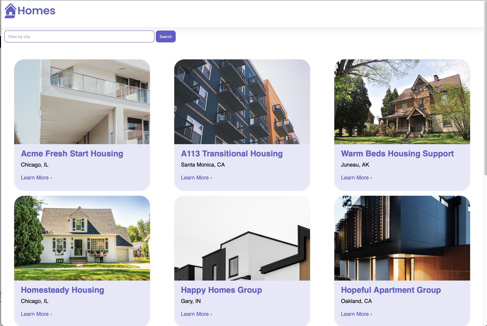
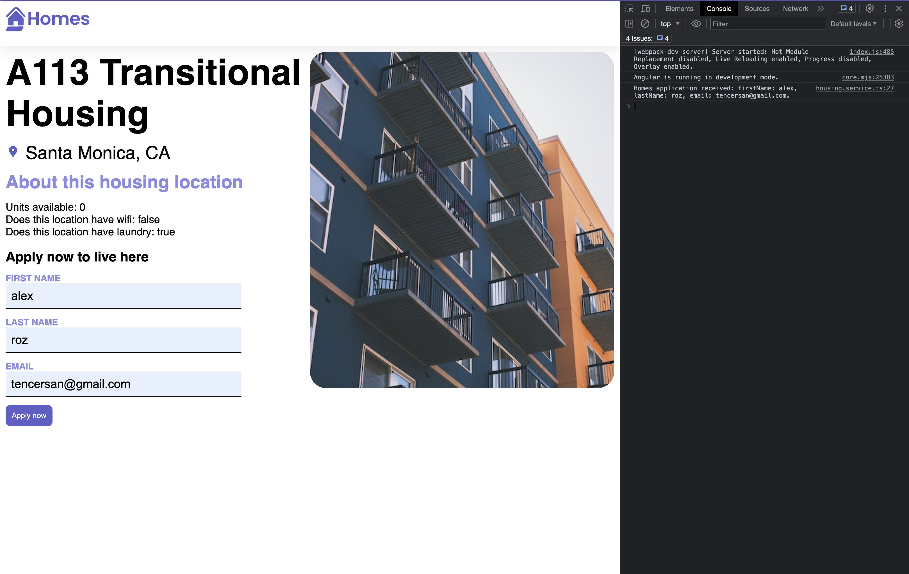

# Angular Homes App

- Install Angular if you don't have it installed

  `npm install -g @angular/cli`

- Once the code has been downloaded

  `cd homes-app`

- Install the depencies

  `npm install`

- Run the application

  `ng serve`

  - Example of a website

